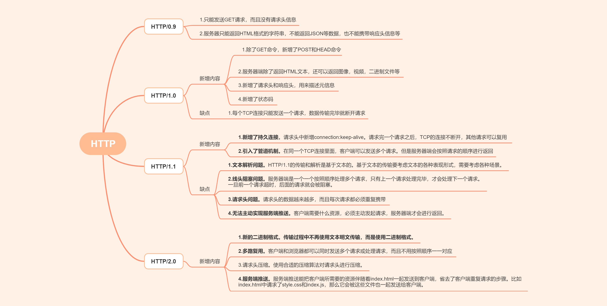

# http的历史



## http/0.9
最早的Http版本是1991年发布的http/0.9版本，这个版本极其简单，只有一个get请求。
TCP 连接（connection）建立后，客户端向服务器请求（request）网页index.html。
协议规定，服务器只能回应HTML格式的字符串，不能回应别的格式以及别的内容。
它的请求格式如下：
```js
GET /index.html
```
响应的格式如下：
```html
<html>
  <body>Hello World</body>
<html>
```
服务器发送完毕，就关闭TCP连接。

## http/1.0
### http/1.0的变化
1996年，发布了http/1.0。相比于http/0.9，http/1.0新增了以下功能：
1. 除了GET命令，还引入了POST命令和HEAD命令，丰富了浏览器与服务器的互动手段
2. 支持返回除HTML以外的文本，比如图像、视频、二进制文件。
3. HTTP请求和回应的格式也变了。除了数据部分，每次通信都必须包括头信息（HTTP header），用来描述一些元数据。
4. 其他还包括了状态码和权限等。
下面是一个1.0的请求格式：
```js
GET / HTTP/1.0
User-Agent: Mozilla/5.0 (Macintosh; Intel Mac OS X 10_10_5)
```
我们可以看到第一行是请求命令，必须在尾部添加协议版本（HTTP/1.0）。后面就是多行头信息，描述客户端的情况。
回应的格式如下：
```js

HTTP/1.0 200 OK 
Content-Type: text/plain
Content-Length: 137582
Expires: Thu, 05 Dec 1997 16:00:00 GMT
Last-Modified: Wed, 5 August 1996 15:55:28 GMT
Server: Apache 0.84
 
<html>
  <body>Hello World</body>
</html>
```
如上图所示：我们可以看到除了返回html内容，第一行返回了HTTP版本号和新增的状态。同时还返回了各种响应字段，用于描述服务器的信息。

### http/1.0的缺点
http/1.0虽然相比于http/0.9新增了很多功能，完善了数据的传输，但是它还是存在一些缺点，它跟http/0.9一样，每个TCP连接只能发送一次请求，也就是说发送一个请求，建立连接，数据传输完毕，断开连接，下个请求需要重新建立TCP连接。TCP连接的新建成本很高，因为需要客户端和服务器三次握手，并且开始时发送速率较慢（slow start）。所以，HTTP 1.0版本的性能比较差。随着网页加载的外部资源越来越多，这个问题就愈发突出了。因此，在http/1.1中进行了改进


## http/1.1
为了解决http/1.0中的连接问题，在1997年，提出了http1.1在http1.0的基础上进行了优化。
### http/1.1的主要改进：
1. 新增了持久连接
http1.1新增了持久连接，也就是在请求头中新增了一个字段:connection:keep-alive。请求完一个请求之后，TCP的连接在一段时间内是不断开的，如果有新的请求，就可以直接复用之前的连接。避免了连接的频繁和关闭。
2.  引入了管道机制
管道机制（pipelining），即在同一个TCP连接里面，客户端可以同时发送多个请求。这样就进一步改进了HTTP协议的效率。举例来说，客户端需要请求两个资源。以前的做法是，在同一个TCP连接里面，先发送A请求，然后等待服务器做出回应，收到后再发出B请求。管道机制则是允许浏览器同时发出A请求和B请求，但是服务器还是按照顺序，先回应A请求，完成后再回应B请求。
3. Content-Length 字段
由于可以引入了管道机制，浏览器同时发送多个请求，客户端会按照顺序做出回应，但是如何
### HTTP/1.x的缺点

HTTP/1.x 虽然已经能解决绝大多数传输问题了，但是还是存在一些问题，比如：

1. 安全问题：HTTP1.x的解析是基于文本。基于文本协议的格式解析存在天然缺陷，文本的表现形式有多样性，要做到健壮性考虑的场景必然很多
2. 传输问题：必须加载完一个请求，才能发送第二次请求(虽然可以并发发送请求，但是之后再想发送请求，必须等到上一个请求返回完毕，才能进行下一次请求发送)
3. header 头非常长，最好进行压缩
4. 服务端无法主动 push(后来出现了 websocket)

## HTTP/2.0

HTTP/2.0 主要是针对 HTTP/1.x 存在的这四个问题，进行了改进：

1. 不再使用明文传输，而是使用二进制进行传输(二进制文件相比于之前的明文，进行了压缩，减小了传输体积)。
2. 实现了多工通信。HTTP/2 复用 TCP 连接，在一个连接里，客户端和浏览器都可以同时发送多个请求或回应，而且不用按照顺序一一对应，这样就避免了"队头堵塞"。举例来说，在一个 TCP 连接里面，服务器同时收到了 A 请求和 B 请求，于是先回应 A 请求，结果发现处理过程非常耗时，于是就发送 A 请求已经处理好的部分， 接着回应 B 请求，完成后，再发送 A 请求剩下的部分。
3. 头部信息压缩
4. 服务器端主动 push