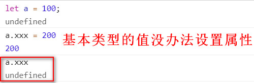
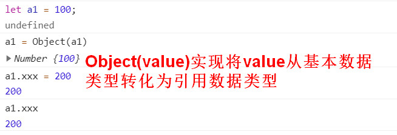

# 修改this

## call,apply,bind的区别
call,apply和bind都是Function.prototype上的原型方法。
### call的实现
```js
let obj1 = {
    name:"hello",
    age:24,
}
function fn(){
    console.log(this.name);
}

fn.call(obj1);  // call修改this的指向
```
1. fn执行的时候，先基于`__proto__`找到`Function.prototype`的`call方法`
2. 将call方法执行。实现了一些功能吗，主要包括：
    * 会把fn执行，
    * 将fn中的this变为第一个实参的值。(如何将传入的第一个参数修改为fn的this了)
因此，我们要实现一个call实际上只需要做两件事情：
1. 拿到fn让它执行。
那么应该如何拿到fn方法的了。事实上，由于是fn调用了call,因此，call方法中的this就是fn
2. 修改fn的this为第一个实参。想象一下修改this除了使用`call,apply,bind`还有哪些方法。
我们查看一下，我们还有哪些常见的很明显的`this`指向；比如obj.fn()，一定指向。那么我们可不可以将
`fn.call(obj,x,y)`修改成`obj.fn(x,y)`，这样的化它的this就指向了obj，同时参数也进行了传递。但是
我们的obj中实际上是没有fn属性的，因此我们需要在call方法中给Obj新增一个fn属性，然后执行。

#### call的简单实现
综上所述，call的实现思路主要包括：
1. 将需要执行的函数和需要改变的this(以指向Obj为例)关联在一起，obj.xxx = fn。
2. 然后只需要执行`obj.xxx`，就相当于执行了fn。
最基础的实现如下：
```js
Function.prototype.call = function call(context, ...rest) {
    context.xxx = this; // this -> fn 当前要执行的函数
    let result = context.xxx(...rest); // context -> obj  rest-> 传递的其他参数
    delete context.xxx; // 删除给obj新增的属性
    return result;
}
```

#### call的进一步优化——使用key确保属性不冲突
如上所示，我们基本上实现了call的方法，但是这种方法存在一个问题，那就是我们新增了一个xxx属性，这个属性可能跟
对象原来的属性重名。这样的话会覆盖原来的属性，最终还会删除原来的属性。
```js
Function.prototype.call = function call(context, ...rest) {
    let key = Symbol("key");  // 使用key来确保属性的唯一性
    context[key] = this; // this -> fn 当前要执行的函数
    let result = context[key](...rest); // context -> obj  rest-> 传递的其他参数
    delete context[key]; // 删除给obj新增的属性
    return result;
}
```
#### call的进一步优化——处理边界条件如果不传入参数
原生的call如果不传入参数，或者参数为null/undefined,那么this指向window
```js
    Function.prototype.call = function call(context, ...rest) {
        context == null ? window : context;
        let key = Symbol("key");  // 使用key来确保属性的唯一性
        context[key] = this; // this -> fn 当前要执行的函数
        let result = context[key](...rest); // context -> obj  rest-> 传递的其他参数
        delete context[key]; // 删除给obj新增的属性
        return result;
    }
```
#### call的进一步优化——处理边界条件传入基本类型的属性
我们知道我们在将fn和obj连接起来是通过给Obj添加属性，但是如果传入的obj是一个基本类型的属性，那么调用时
会报错，这是因为基本类型的值是没办法设置属性。
```js
let a = 100;
a.xxx = 200
console.log(a.xxx)  // undefined
```

因此，我们必须保证我们的context必须是一个引用类型的值。(无论你传递给我们的是什么类型)，那么如何将基本数据类型包装成引用数据类型了。
```js
let a1 = 100;
a1 = new Number(100)
a1.xxx = 200
console.log(a1.xxx)  // 200
```
我们可以看到，将基本数据类型转换成引用数据类型，只需要使用构造函数重新创建即可。

因此关键是获取到`Number`这个构造器，而构造器可以通过constructor进行获取。
```js
a = new a.constructor(a);
```
但是这种方法存在一个问题，那就是`Symbol`和`bigint`数据类型不支持通过new来进行调用。因此，我们需要找到一种通用的方法来实现将基本数据类型值转化为引用数据类型，那就是`Object(value)`。

因此，最终的实现如下：
```js
    Function.prototype.call = function call(context, ...rest) {
        context == null ? window : context;
        if(!/^(object|function)$/.test(typeof context)){
            context = Object(context); // 转化成引用数据类型
        }
        let key = Symbol("key");  // 使用key来确保属性的唯一性
        context[key] = this; // this -> fn 当前要执行的函数
        let result = context[key](...rest); // context -> obj  rest-> 传递的其他参数
        delete context[key]; // 删除给obj新增的属性
        return result;
    }
```

####  call的实现总结：
call的实现核心就四行+3行：
```js
    Function.prototype.call = function call(context, ...rest) {
        context[key] = this; // this -> fn 当前要执行的函数
        let result = context[key](...rest); // context -> obj  rest-> 传递的其他参数
        delete context[key]; // 删除给obj新增的属性
        return result;
    }
```
3个边界条件的的处理
1. 属性唯一
2. 传入为null或者undefined时指向window
```js
    Function.prototype.call = function call(context, ...rest) {
        context == null ? window : context;
        if(!/^(object|function)$/.test(typeof context)){
            context = Object(context); // 转化成引用数据类型
        }
        let key = Symbol("key");  // 使用key来确保属性的唯一性
    }

```

### apply的实现
```js
Function.prototype.apply = function(context,params){
    context = context == null ? window : context;
    if(!/^(object|function)/.test(typeof context)){
        context = Object(context);
    }
    let key = Symbol("key");
    context[key] = this;
    let result = context[key](...params);
    return result;
}
```

### bind的实现
我们经常使用bind的场合，比如点击事件时：
```js
document.body.onclick = fn.bind(obj,"165",63);
```
如果不使用bind，那么可能会这样写：
```js
document.body.onclick = function(ev){
    fn.call(obj,"165",63,ev);
}
```
bind的实现是基于call的。
```js
    Function.prototype.bind = function (context, ...params) {
        let that = this;
        return function(...rest){
            return that.call(context,...params,...rest)
        }
    }
```
