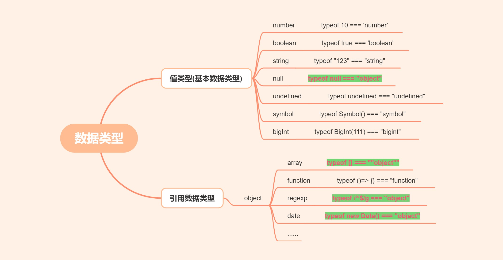
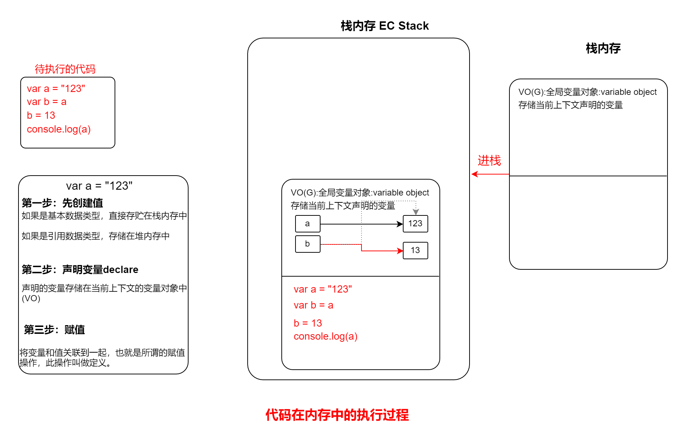
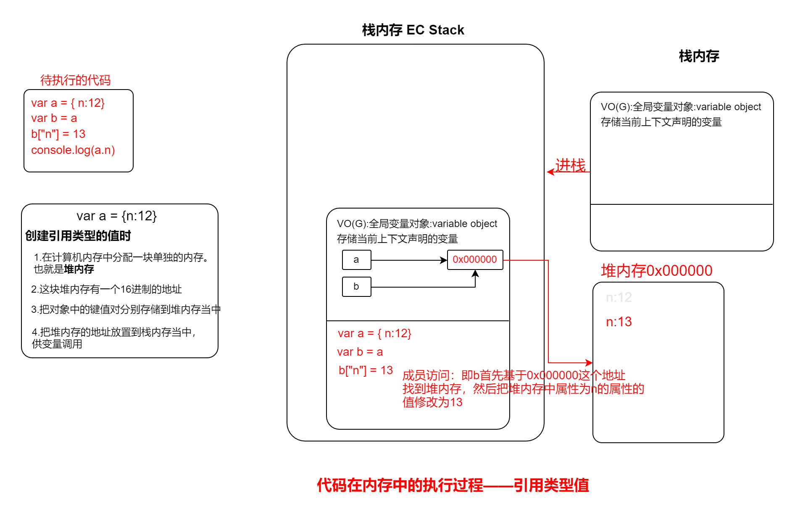
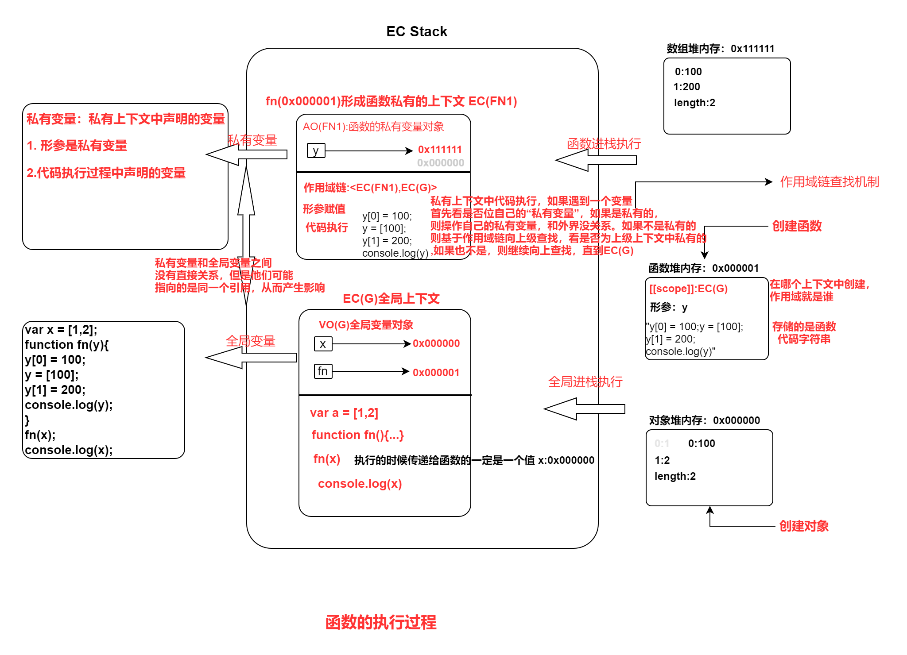

# 数据类型和堆栈内存

## 8种数据类型


1. 区分js中的8中数据类型。注意函数，数组等不是数据类型
2. 使用typeof进行类型判断的两个缺点：
* 1. typeof null === "object"
* 2. 数组，正则，日期等数据，使用typeof进行判断时得到的只是"object"，无法得到明确的数据类型。

### typeof为什么不能准确地检测数据类型
这与typeof的底层原理有关：
在计算机底层中，所有的数据类型值的存储都是按照二进制进行存储的。其中：
1. null -> 000000（null表示空，它在底层的存储对应的就是6个0，也就是000000）
2. 只要是对象类型(无论是普通对象还是数组对象等，除了函数其他对象都是以000开头)，所有的存储都是以000开头。
3. typeof检测的时候，是按照计算机存储的值来进行检测的。它检测null的时候，会发现以000开头，就把它当做object类型进行处理了。


### 判断是否是有效数字
使用isNaN来判断一个字符是否是有效数字，如果isNaN返回的是false，那么表示是有效数字，如果返回的是true，表示是NaN,也就是说不是数字。
```js
var str = "abc123"
console.log(isNaN(str[0])) // true
console.log(isNaN(str[3])) // false
```
### Symbol
1. Symbol无法通过new 来进行创建
因为Symbol创建的是一个基本类型的值，它是不涉及到引用的，也就是说它无法像构造函数一样，生成一个对象，然后把this的值指向这个对象。因此，创建Symbol时，直接调用`Symbol()`即可。
2. Symbol是唯一的。
```js
console.log(Symbol() === Symbol())  // false
```
3. 为了能够区分创建的Symbol，我们通常给`Symbol("aaa")`创建时添加标记，这个标记纯粹是用于区分，哪怕标记相同，他们也是不相等的。
4. 一般只有在给对象设置唯一的属性时，才会使用Symbol
5. **Symbol原型上的很多方法和属性都会在其他方法的原理中得到使用。**


### bigint 超大数字
前端数字的范围是[Number.MIN_SAFE_INTEGER,Number.MAX_SAFE_INTEGER]，也就是[-2^53,2^53]。如果超过这个数字的话就会不准确了。
```js
var a = Number.MAX_SAFE_INTEGER // 9007199254740991
console.log(a + 4)  // 9007199254740996  不准确了
```
因此为了准确性提出了超大数字。在数组后面加个n表示超大数字。
```js
console.log(9007199254740991n+4n)  // 9007199254740995n
```
注意：超大数字进行操作时，必须两个都是超大数字。

## 数据类型的区别——堆和栈

JS代码的常见运行环境：
1. 浏览器
2. Node
3. webview

### 浏览器是如何执行JS代码的

1. 浏览器能够运行JS代码，主要原因是会在计算机的内存当中，分配出一块内存，用来供代码执行。这部分内存被称作“栈内存”，也就是所谓的执行环境栈(Execution Context Stack，EC Stack)。
2. 浏览器在执行过程中，会区分是哪个区域下的代码在执行。为了区分是哪个区域下的代码执行(全局下的代码还是函数中的代码)，会产生一个执行上下文(Execution Context,EC)。
* EC(G) 全局执行上下文
3. 在执行过程中，会定义一些变量，这些变量都放在执行上下文的VO(variable object，变量对象)中。
4. 代码执行，分为三步，创建值，创建变量，给变量赋值(将变量和值关联起来)。
#### 值类型的值在内存中的执行过程
如下所所示，是一段代码在栈中的执行过程。
```js
var a = "123";
var b = a;
    b = 13;
console.log(a)

```


#### 引用类型的值在内存中的执行过程
由于引用类型的值，比如对象等通常存储的数据比较多，不方便放在栈中进行存储，因此通常会单独开辟一个内存空间，用于存储引用内存的值，这块内存空间又被称作堆内存。我们看下引用数据类型的值在内存中的执行过程。


#### 基本类型值和引用类型值的区别
从上面的分析，我们可以看出基本类型值和引用类型值的最大区别是：基本类型值是直接存储在栈内存中的,`按值操作`，而引用类型的值是直接存储在堆内存中的，操作的都是`引用地址`。


## 函数的底层处理机制

JS中的上下文（哪一个区域中执行的）
* 全局上下文
* 函数执行，会形成私有上下文
* ES6中的块级私有上下文

1. 创建一个函数和创建一个变量类似，都是声明一个变量存储值，只不过函数存储的是函数名。
函数创建类似于：
```js
function func(){}        // 函数声明
var func = function(){}  // 函数表达式
```
2. 创建一个函数也需要开辟内存地址，只不过对象中存储的是它的键值对，而函数堆内存中存储的是它的代码，
而且是以字符串形式存储。
3. 创建函数的时候就声明了他的作用域scope。值是当前创建函数时的上下文。
   * 开辟一个堆内存空间
   * 声明它的作用域
   * 存储函数的代码 
4. 函数执行时，传递的实参一定是一个值。(哪怕是一个变量，也是变量计算后得到的值)
5. 函数执行时，生成函数的执行上下文，会生成一个Active Object(AO,变量对象的一种,全局的是VO)
   * 生成一个私有的上下文(同时会创建一个私有的变量对象即AO，用来存储当前上下文声明的变量)，然后进栈执行。
   * 代码执行前，需要做以下事情：
     1. 初始化作用域链scope-chain。<当前自己的私有上下文,创建函数时的上下文>即<EC(FN1),EC(上级上下文)>
     2. 初始化this
     3. 初始化arguments
     4. 形参赋值:在当前上下文中，声明一个形参变量，并且把传递的实参值赋值给形参
     5. 变量提升
   * 代码执行
   * 出栈释放
我们执行如下代码，查看他的执行过程：
```js
var x = [1,2];
function fn(y){
    y[0] = 100;
    y = [100];
    y[1] = 200;
    console.log(y);
}
fn(x);
console.log(x);
```
详细的执行过程如下所示：
;