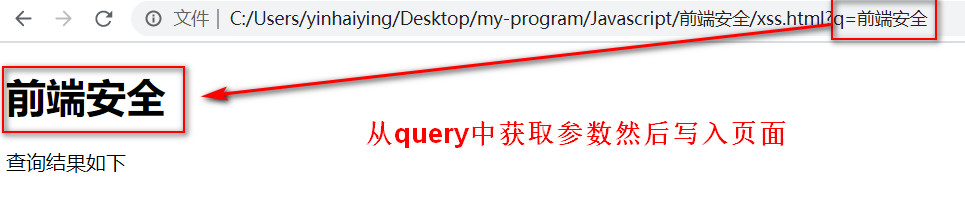
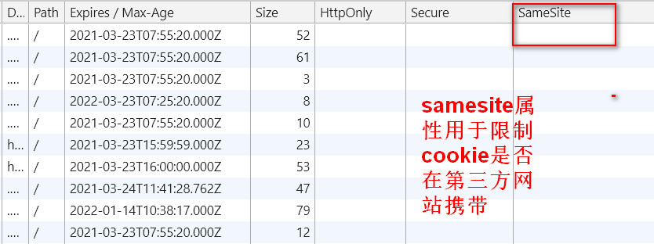

# 前端安全


## XSS
xss的全称是`cross-site-scripting`，跨站脚本攻击。注入恶意代码到网页，并使得用户加载执行。其目的
可能有：
1. 获取当前用户在这个网站的`cookies`，从而拿到用户的敏感信息
2. 以当前用户的身份发起一些非用户本意的操作请求，比如删除网站好友，发帖，发信息等。
3. 实现DDos攻击。

### XSS的分类
XSS的攻击分为两种类型：非持久型和持久型
#### 非持久型攻击
非持久型攻击是即时性的，恶意代码不需要存在数据库中。假设我们写了一段这样的代码，用户获取query中的值，然后将这个值写入`h1`标签中。
```html
    <h1 id = "query-key"></h1>
    <span>查询结果如下</span>
    <script>
        const reg = new RegExp("(^|&)q=([^&]*)(&|$)","i");
        const res = window.location.search.substr(1).match(reg);
        if(res !== null){
            const query = documentURIComponent(res[2]);
            // 将query直接设置到h1标签身上
            document.getElementById("query-key").innerHTML = query;
        }
    </script>
```
页面展示效果如下：

这样的话，我们假如将q的值设置成了一段恶意代码：
恶意代码一：
```js
q=<script>alert(document.cookie)<script>
```
上面这段代码被拦截了，因为浏览器对`script`等危险标签的插入做了拦截过滤。
恶意代码二：
```js
q=
```
我们使用img标签，但是给img的`src`属性设置了错误的地址，这样的话它就会触发onerror事件，从而拿到用户的cookie。从上面的分析我们可以知道，这种xss攻击是不需要存入数据库中的，每次页面更新都可能触发这种攻击，因为它网页面中插入了可执行的脚本(通过script等标签，或者onerror等事件)。

#### 持久型攻击
将恶意代码存入了数据库，例如用户A是黑客，在评论中输入了一条评论：评论的内容是：
```html

```
用户B是普通用户，访问了评论页面的时候，就会加载这条内容，这时候就会弹出这个cookie（对于黑客来说，拿到cookie等信息就可以做很多事情了）。

### XSS的防御
我们知道XSS的全称是跨站脚本攻击，实际上是往页面HTML中插入了一些可执行的脚本。因此，对于这些能够进行插入或者写入的操作都需要进行处理。
1. 使用HTML转义。对所有外部插入的代码都应该做一次转义，将`script`，`&<>"'/`等危险字符做过滤和转义替换，同时尽量避免使用`innerHTML`,`document.write`,`outerHTML`,`eval`等方法，用安全性更高的`textContent`或者`setAttribute`等方法代替
2. 开启`CSP`防护，在HTTP响应头中设置`Content-Security-Policy`。
```js
Content-Security-Policy:script-src 'self'
// 不允许内联脚本执行
// 禁止加载外域代码
// 禁止外域提交
```

## CSRF
CSRF(cross-site request forgery)，跨站请求伪造。
它的流程如下：
* 用户登录目标网站A（www.a.com）；
* 用户以某种方式接触到恶意网站B中的链接
* 用来点击链接访问网站B(www.xxx.com)，网站B中的js代码执行，偷偷向目标网站A发送请求；
* 由于用户登录过网站A（www.a.com），因此请求会携带了网站A的相关cookie凭证，最后请求成功。

注意：这里需要着重强调一点的是，网站B中的js代码执行，它发送了一个这个请求`a.com/api/delete`，由于它发送的域名是`a.com`，那么浏览器就会主动找到这个`a.com`下的cookie，在发送请求时，携带上这个cookie，也就是说不需要去考虑是否因为同源策略，从B网站访问A网站必须同源,最核心的是它登录过A网站，那么发送的所有跟A网站域名相关的请求都会携带A网站的cookie。

### 实例
假如B网站有以下代码，就会删除A网站的数据
```html

```


### 防御方式
1. 设置`cookie`的`SameSite`属性。
`SameSite`是`set-cookie`的属性，它允许您声明Cookies只会在第一方上下文中发送，不会与第三方网站发起的请求一起发送。更加通俗地来说，也就是限制cookie的发送范围。
`Lax`：Cookies允许与顶级导航一起发送，并将与第三方网站发起的GET请求一起发送。这是浏览器中的默认值，实际上是大多数情况下都不会发送第三方cookie，但是导航到目标网站的get请求除外。比如，通过img,script,form表单等
```html
<a href = "a.com/delete">
<link rel = "prerender" href = "a.com/delete">
<form method = "GET" action = "a.com/delete">
```
`Strict`：Cookies只会在第一方上下文中发送，不会与第三方网站发起的请求一起发送,也就是跨站点时，任何情况下都不会发送cookie，只有当前网页的URL与请求目标一致时，才会带上cookie。因此，如果我们想要防止csrf攻击，可以设置为`strict`。
`None`：Cookie将在所有上下文中发送，即允许跨域发送。
我们可以看下浏览器中的cookie设置，如下图所示：

设置方法为：
```js
Set-Cookie:a_session=123;SameSite=None;secure
```

2. 增加token校验
我们知道由于B网站发送的A网站的域名相关的请求，会自动携带上A网站域名对应的cookie，从而伪造操作，之所以能够操作就是因为发送请求时，浏览器会自动携带上对应的域名的cookie，但是如果我们在前后端新增了`token`校验，而`token`是不会被浏览器主动携带的，只有确实是A网站进行的操作，才可能携带`token`，第三方的网站无法获取到`token`，因此服务器就会拦截没有携带`token`的请求，从而避免这种攻击。实际上就是相当于增加了一层校验规则。

3. 服务端通过请求头中的`Referer`和`Origin`字段，判断请求来源。如果来源不是我们的网站，服务器就可以直接拦截。
4. 增加手机，邮箱等二次验证。


## Vue的安全措施

由于vue中使用了模板语法，也就是说Vue中的内容，都会作为一个Js进行执行，因此，如果插入的模板是不安全的，这样的话会带来问题。示例：
```js
new Vue({
  el: '#app',
  template: `<div>` + userProvidedString + `</div>` // 永远不要这样做
})
```
这里的`userProvidedString`可能是下面这种:
```js

```
这样的话onerror事件会被执行，导致攻击，也就是说模板中可能被嵌入这种不安全的内容。
vue主要做了以下措施：
### HTML内容
不论使用模板还是渲染函数，内容都会被自动转义。也就是说，对于这份模板：
```js
<h1>{{ userProvidedString }}</h1>
```
如果`userProvidedString`包含了：
```js
'<script>alert("hi")</script>'
```
那么`<`,`>`这些这些符号等都会被转义：
```js
&lt;script&gt;alert(&quot;hi&quot;)&lt;/script&gt;
```
因此避免了脚本注入。该转义通过诸如 textContent 的浏览器原生的 API 完成，
所以除非浏览器本身存在安全漏洞，否则不会存在安全漏洞。

### Attribute绑定
同样地，动态属性的绑定也存在危险，如果属性绑定了一些危险内容，也可能带来XSS攻击。比如：
```js
<h1 v-bind:title="userProvidedString">
  hello
</h1>
```
如果`userProvidedString`绑定的是下面这个内容：
```js
'" onclick="alert(\'document.cookie\')'
```
vue在属性绑定时，在内部也做了一些内置的转义，上面的代码会被转义成：
```js
&quot; onclick=&quot;alert('hi')
```
因此避免了通过闭合 title attribute 而注入新的任意 HTML。该转义通过诸如 setAttribute 的浏览器原生的 API 完成，
所以除非浏览器本身存在安全漏洞，否则不会存在安全漏洞。