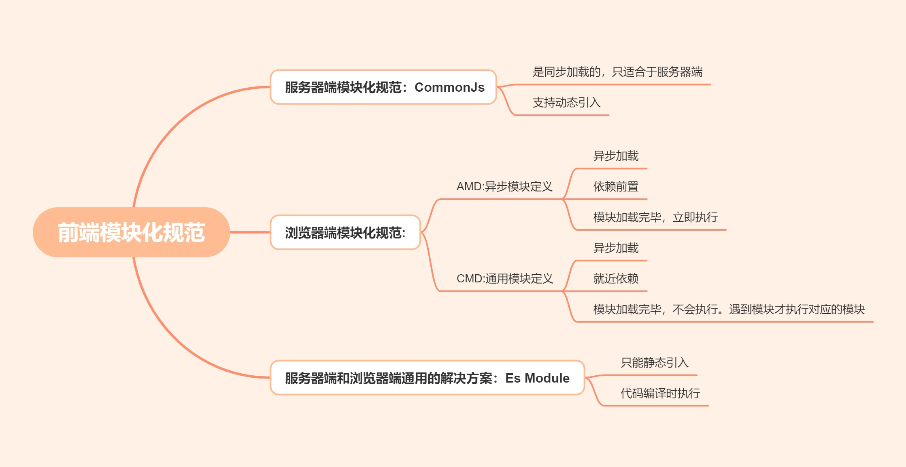
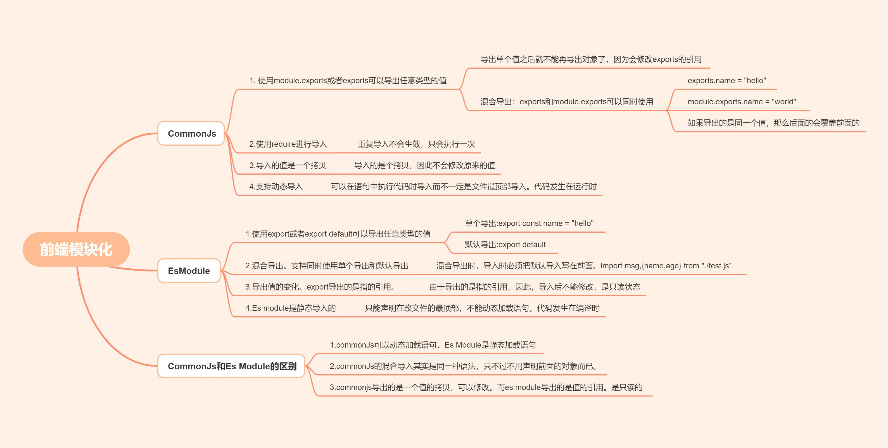

# 前端模块化

## 前端模块化的历史


### 模块化的历史进程
1. 全局function模式：将不同的功能封装成不同的全局函数。每个函数就是一个模块。
   * 污染全局明明空间，容易引起命名冲突。
   * 各个模块之间依赖关系不清楚
2. 简单命名空间：简单对象分装。将相关的功能封装到一个对象下进行管理。
   * 减少了全局变量，降低了命名冲突
   * 但是数据不安全，外部可以直接修改模块内部数据
```js
let myModule = {
  data: 'www.baidu.com',
  foo() {
    console.log(`foo() ${this.data}`)
  },
  bar() {
    console.log(`bar() ${this.data}`)
  }
}
myModule.data = 'other data' //能直接修改模块内部的数据
myModule.foo() // foo() other data
```
3. IIFE模式：匿名函数自执行(闭包)
为了不让外部能够随意地修改内部数据，通过使用闭包来保护内部数据，修改数据只能通过调用内部方法。
```js
// module.js文件
(function(window) {
  let data = 'www.baidu.com'
  //操作数据的函数
  function foo() {
    //用于暴露的函数
    console.log(`foo() ${data}`)
  }
  function bar() {
    //用于暴露的函数
    console.log(`bar() ${data}`)
    otherFun() //内部调用
  }
  function otherFun() {
    //内部私有的函数
    console.log('otherFun()')
  }
  //暴露行为
  window.myModule = { foo, bar } 
})(window)
```
这样的话，每一个IIFE就是一个模块，解决了命名问题和数据安全的问题。在很长一段时间内，我们都使用这种方式将闭包作为模块。

### 模块化的好处
* 避免了命名冲突(减少命名空间污染)
* 更好地管理数据(每个模块管理自己的数据)
* 更好地复用
* 更好地维护

### 模块化带来的问题
在模块化的使用过程中，我们通常会将其放入script标签中进行引入，这样的话会导致：
* 请求过多
首先我们需要依赖多个模块，那么就会发送多个请求，导致请求过多
* 依赖模糊 
我们需要很清楚他们之间的依赖关系，那个模块需要先加载，哪个需要后加载，必须严格控制script加载顺序
以上两个问题，会带来项目的难以维护，很容易出现牵一发而动全身。而模块化规范就是为了解决这两个问题而出现的。
最常见的模块化规范就是commonjs,AMD,Es Module和CMD。

### 模块化规范




## CommonJs
Node 应用由模块组成，采用 CommonJS 模块规范。每个文件就是一个模块，有自己的作用域。在一个文件里面定义的变量、函数、类，都是私有的，对其他文件不可见。在服务器端，模块的加载是运行时同步加载的；在浏览器端，模块需要提前编译打包处理。


### CommonJs中使用`module.exports`导出变量和函数
1. CommonJs中使用`module.exports`导出变量和函数，也可以导出任何类型的值，我们通常会导出一个对象，如下所示：
```js
module.exports = {
    name:"hello",
    age:24
}
```
但是，实际上它也可以一个个地导出其他值，比如字符串，数字，函数等。如下所示：
```js
module.exports.name = "hello";
module.exports.age = 24;
```
上面两种方式的写法，我们最终导入时，都会得到：
```json
{name:"hello",age:24}
```

### CommonJs中可以省略module直接使用exports进行导出
在CommonJs中可以省略module直接使用`exports`进行导出，其功能和`module.exports`完全一致。如下所示：
```js
exports.name = "hello";
exports.age = 24;
```
### CommonJs中导出的是同一个对象，因此后面的值会覆盖前面的值，后面的引用会覆盖前面的引用
CommonJs实际上只导出了一个对象，因此如果你定义了两个相同的属性，后面的值会覆盖前面的值，示例：
```js
exports.name = "hello";  // 定义了属性name
exports.age = 24;

module.exports.name = "world";  // 定义了属性name
```
我们可以发现，使用两种方式定义了属性`name`，最终的输出对象如下所示：
```json
{ name: 'world', age: 24 }
```
后面的`name`属性覆盖了前面的name属性。
如果你后面定义了一个引用类型的值，那么后面的引用也会覆盖前面的引用。如下所示：
```js
exports.name = "hello";
exports.age = 24;

module.exports ={
    sex:"男",
    height:165
}
```
我们可以发现，前面我们用exports导出了两个值，他们是一个引用，但是后来又使用`module.exports`导出了一个引用类型的值，其实相当于后面修改了前面导出的对象的引用。因此，最终之后得到后面的导出的值，如下所示：
```json
{ sex: '男', height: 165 }
```
通过上面的知识，我们可以知道CommonJs规范加载模块是同步的，也就是说，只有加载完成，才能执行后面的操作。这对于服务器来说是完全可以的，模块文件一般都已经存在于本地硬盘，所以加载起来比较快，不用考虑非同步加载的方式，所以commonjs规范就适用了。但是，对于浏览器环境，要从服务器加载模块，通常是通过script标签进行加载，而script标签是异步执行的，使得传统的CommonJs在浏览器中无法正常加载。解决思路之一，就是我们在服务器端，获取到所有的模块，然后分析他们的依赖关系，按照依赖关系返回给浏览器端，但是这需要服务器端去做额外的工作，很明显是不划算的，那么我们就只能在浏览器端去定义自己的模块规范了。**但是如何去定义模块以及模块的依赖，模块的加载等又产生了分歧：**

## AMD(Asynchronous Module Definition)异步模块定义
AMD规范是浏览器模块规范的一种，从它的名字可以看出，它是异步模块定义的意思。由于AMD规范不是Javascript原生支持，因此使用AMD需要使用一个库函数，也就是`requrie.js`。`require.js`只要解决了两个问题：

1. 多个js文件可能有依赖关系，被依赖的文件需要早于依赖它的文件加载到浏览器。依赖前置
2. 异步加载

```js
// 定义模块 myModule.js
define(['dependency'], function(){
    var name = 'Byron';
    function printName(){
        console.log(name);
    }
    return {
        printName: printName
    };
});

// 加载模块
require(['myModule'], function (my){
　 my.printName();  // 只有模块全部加载完成之后才回执行
});
```

## CMD规范(Common module Definition)
CMD规范即通用模块定义规范，是国内发展起来的，由于它也不是Javascript的原生规范，因此同样需要使用额外的库即`seajs`，`seajs`要解决的问题和`requirejs`一样，只不过在模块定义方式和模块加载方式实际上有所不同。
1. 一个文件一个模块，因此经常以文件名作为模块id
2. cmd推崇依赖就近(也就是使用时采取加载依赖)，所以一般不在define的参数中写依赖，在factory中写。
3. 由于依赖就近，因此不需要提前加载依赖
```js
define(function(require, exports, module) {
  var $ = require('jquery.js')
  $('div').addClass('active');
});

// 加载模块
seajs.use(['myModule.js'], function(my){

});
```

## AMD和CMD的区别
AMD和CMD最大的区别是对依赖模块的**执行时机**处理不同，注意不是加载的时机或者方式不同。他们加载模块都是异步的，只不过AMD依赖前置，js可以方便知道依赖的模块是谁，立即加载。而CMD就近依赖，需要使用把模块变成字符串解析一遍才知道依赖了哪些模块。但是他们都是异步记载模块的。

* 执行时机不同。
AMD是加载完模块之后立即执行该模块(每个模块实际上就是一个js文件)，这样的效果是依赖模块的执行的顺序不一定和书写顺序一致，哪个先加载可能先执行。但是主逻辑是必须在所有依赖加载完成后执行。
CMD加载完某个依赖模块后并不执行，只是下载而已，在所有模块加载完成后，进入主逻辑，遇到require语句的时候，才会去执行对应的模块，这样的话模块的执行顺序和书写顺序完全一致。


## ES module
ES6 在语言标准的层面上，实现了模块功能，而且实现得相当简单，完全可以取代 CommonJS 和 AMD 规范，成为浏览器和服务器通用的模块解决方案。
ES Module是浏览器端和服务器端通用的模块解决方案。

比较CommonJs和Es Module的区别
